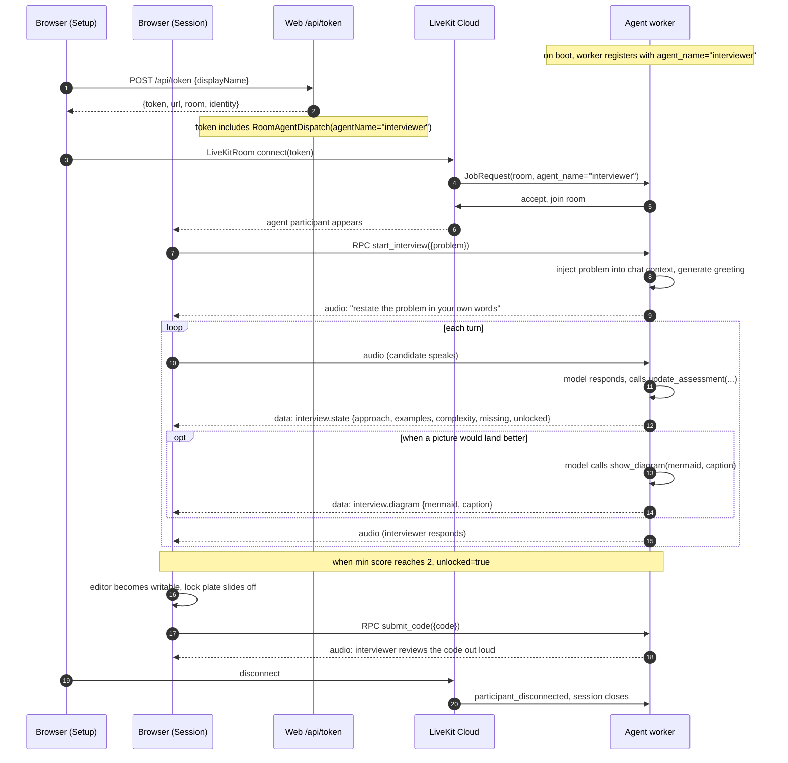

# Architecture

This document describes how the mock interviewer is put together, why the
pieces are where they are, and where to extend it. `CLAUDE.md` covers the
day-to-day working notes (conventions, deploy checklist, the traps we've
already burned time on); read that first if you're going to change code.

- [The premise: the gate](#the-premise-the-gate)
- [Where the gate lives, and why](#where-the-gate-lives-and-why)
- [System overview](#system-overview)
- [The rubric](#the-rubric)
- [Interview lifecycle](#interview-lifecycle)
- [Contracts between agent and browser](#contracts-between-agent-and-browser)
- [Agent internals](#agent-internals)
- [Web internals](#web-internals)
- [Extension points](#extension-points)
- [Trade-offs](#trade-offs)

## The premise: the gate

An interview is not a typing exercise. The signal it produces — "can this
person actually reason about their code before they write it" — comes from
the part before the editor opens. This app forces that part to happen out
loud by locking the editor until a live interviewer has heard the candidate:

1. commit to a data structure and algorithm and justify them,
2. trace the approach on a real input, showing intermediate state, and
3. state and justify time and space complexity.

The editor unlocks when a rubric across those three axes reaches a passing
score. The whole product is that gate. Every design decision either
enforces it or supports it.

## Where the gate lives, and why

The gate lives in the agent process, not the browser.

Why: the browser sees only what the agent tells it. If the browser owned
the gate, the model could inflate its own scores, or a well-crafted DevTools
paste could unlock the editor without ever talking. Keeping the gate on the
Python side means the model *asks* the gate to update scores (through a
tool call), the gate applies the rules (clamp to 0–3, ratchet, compute
`unlocked`), and only then does it push state to the browser.

The browser re-checks the unlock rule when it receives state, but treats
the agent as the authority. Never let the model unlock anything directly.

## System overview

```
browser (Next.js)                          agent worker (Python)
  ┌──────────────────┐                      ┌───────────────────────┐
  │  mic + speaker   │ <────── WebRTC ────> │  OpenAI Realtime      │
  │  track           │                      │  (speech-to-speech)   │
  ├──────────────────┤                      ├───────────────────────┤
  │  useInterview-   │ <── data channel ─── │  update_assessment    │
  │  Gate hook       │    interview.state   │  -> Assessment        │
  │                  │                      │                       │
  │  Whiteboard      │ <── data channel ─── │  show_diagram         │
  │  (Mermaid)       │   interview.diagram  │                       │
  ├──────────────────┤                      ├───────────────────────┤
  │  Setup / Session │ ─── RPC over LK ───> │  start_interview      │
  │  UI              │                      │  request_hint         │
  │                  │                      │  submit_code          │
  └──────────────────┘                      └───────────────────────┘
```

- **WebRTC audio** carries the actual conversation. The candidate's mic
  publishes into the room; the agent subscribes. The agent's TTS output
  publishes into the room; the browser plays it via `RoomAudioRenderer`.
- **Data channel** carries structured events. Two topics:
  `interview.state` (rubric updates) and `interview.diagram` (Mermaid
  drawings for the whiteboard).
- **RPC over LiveKit** carries user-initiated actions from browser to
  agent: hand off the problem, ask for a hint, submit code.

LiveKit is used purely as transport. There's no LiveKit server logic
beyond routing.

## The rubric

Three axes, each scored 0 to 3 by the model:

| axis         | earns a 2 when                                        |
|--------------|-------------------------------------------------------|
| `approach`   | a correct data structure and algorithm are stated and justified |
| `examples`   | the candidate has traced a real input and shown intermediate state |
| `complexity` | time and space costs are stated and explained         |

Passing is 2. The editor unlocks when `min(approach, examples, complexity) >= 2`.

Scores **ratchet up only**. A candidate never loses ground they've earned
even if a later turn is sloppy. This exists so the interviewer can be
harsh mid-conversation without penalising the candidate for revisiting a
solved point.

The rubric shape is duplicated in three files by design (schema-of-record
in `agent/agent.py`, mirror on the frontend in `web/hooks/useInterviewGate.ts`
and `web/components/rubric.tsx`). CLAUDE.md's conventions call out that if
the rubric changes, all three files must change in the same commit.

## Interview lifecycle



A few notes on timing that aren't obvious from the diagram:

- The agent stays silent from job accept until it receives
  `start_interview`. The greeting is not part of `on_enter` — the model
  needs the problem in context before it can produce a useful opener.
- `update_assessment` is expected on every substantive turn even when
  nothing changed. Realtime models get lazy about tool calls, and a
  periodic system-message backstop nudges the model back on task if the
  scoring goes quiet.
- The unlock announcement ("the editor is ready, you can start coding")
  comes from the tool's return string, not from a separate turn. When
  `update_assessment` pushes the state that flips the gate to unlocked,
  its return value tells the model *to stop talking* so the candidate can
  work.

## Contracts between agent and browser

### RPC methods (browser -> agent)

All three are registered on `ctx.room.local_participant` at worker startup
and take a JSON payload. Return `"ok"`, `"empty"`, or a short string.

| method             | payload                 | effect                                                                 |
|--------------------|-------------------------|------------------------------------------------------------------------|
| `start_interview`  | `{ problem: string }`   | Inject problem as a system message, publish initial gate state, greet. |
| `request_hint`     | `{ level: 1 \| 2 \| 3 }` | Trigger a hint at escalating levels 1–3. Never produces code.          |
| `submit_code`      | `{ code: string }`      | The interviewer reviews the code out loud, naming the first real issue.|

### Data channel (agent -> browser)

Two reliable topics, both JSON-encoded UTF-8.

**`interview.state`** — pushed after every `update_assessment` call:

```jsonc
{
  "approach":   0 | 1 | 2 | 3,
  "examples":   0 | 1 | 2 | 3,
  "complexity": 0 | 1 | 2 | 3,
  "missing":    "one short phrase naming the weakest area",
  "unlocked":   boolean
}
```

**`interview.diagram`** — pushed when the model calls `show_diagram`:

```jsonc
{
  "mermaid": "graph LR\nA-->B-->C",
  "caption": "optional short line, or empty string"
}
```

The frontend re-checks `min(...) >= 2` when it receives state; it trusts
the agent but the check is cheap. The `Diagram` type additionally records
a client-side `at` timestamp so a new diagram unmounts and replaces the
old one via a React `key`.

## Agent internals

`agent/agent.py` is one file. The pieces:

**`Assessment` dataclass** — the gate's state. Holds the three scores plus
the free-text `missing`. `unlocked` is a computed property, not a stored
field, so it can never drift out of sync with the scores.

**`Interviewer(Agent)` subclass** — holds the room, the assessment, and
the problem text. Owns two function tools:

- `update_assessment(approach, examples, complexity, missing)` — clamps
  each score to `[0, 3]`, ratchets against the current value with `max`,
  publishes on `interview.state`. Returns a directive string to the
  model: on unlock, "tell them briefly, then stop talking"; otherwise,
  "editor still locked; weakest area is X."
- `show_diagram(mermaid_source, caption)` — publishes on
  `interview.diagram`. Returns "ask a question about it — do not
  narrate it" so the model doesn't turn the picture into a monologue.

**`entrypoint(ctx: JobContext)`** — builds the `AgentSession` with
OpenAI's `RealtimeModel`. `voice="marin"`, `modalities=["audio"]`,
`semantic_vad` with `interrupt_response=True` and `eagerness="high"`.
BVC noise cancellation is configured via `RoomOptions(audio_input=...)`
(the old `RoomInputOptions` shape is deprecated in agents 1.7+).

**RPC registration** — three methods on `ctx.room.local_participant`.
`start_interview` injects the problem as a system message and calls
`session.generate_reply(instructions=...)` with a short cap; it
deliberately never uses `session.say()`, which is prone to looping the
opening line on interruption on the Realtime path.

**`keep_scoring()` backstop** — a background task that, every 45s, if the
interview is live and the gate hasn't moved, appends a system message
reminding the model to call `update_assessment`. Realtime models drift
into pure conversation mode after a few turns and silently stop scoring;
this nudges them back.

**Explicit dispatch** — `WorkerOptions(agent_name="interviewer")`. LiveKit
Cloud does not auto-dispatch bare workers to rooms (unlike
livekit-server); the browser's token must include a matching
`RoomAgentDispatch` in `roomConfig.agents`. Both sides are wired for this.

## Web internals

Route: single page at `/`, one API route at `/api/token`.

### Component tree

```
app/page.tsx                        setup <-> session router
├─ components/setup.tsx             problem paste, "begin interview" button
└─ LiveKitRoom (wraps session)
   └─ components/session.tsx        session shell + orchestration
      ├─ RoomAudioRenderer          plays the interviewer's audio
      ├─ StartAudio                 autoplay-block fallback
      ├─ components/transcript.tsx  right-edge tab + drawer
      ├─ components/clock.tsx       session clock (mm:ss)
      ├─ components/mic-indicator.tsx  your mic level
      ├─ components/whiteboard.tsx  audio ribbon + Mermaid diagram slot
      │  └─ components/waveform-ribbon.tsx
      ├─ components/rubric.tsx      bar meters + missing hint (Rubric + RubricStrip)
      ├─ components/code-editor.tsx  CodeMirror 6, themed
      └─ components/lock-plate.tsx  frosted overlay while locked
```

### `useInterviewGate()` hook

`web/hooks/useInterviewGate.ts` owns everything data-channel and RPC:

- Subscribes to `RoomEvent.DataReceived` on the current room, filters by
  topic, decodes JSON, and exposes:
  - `gate: Gate` — current rubric state, unlock recomputed defensively.
  - `diagram: Diagram | null` — most recent diagram plus a `at` timestamp
    (used as a React `key` so a new diagram unmounts the previous one).
- Tracks the agent participant identity (any remote with `isAgent` or
  identity prefix `agent`), because RPC needs `destinationIdentity`.
- Exposes typed wrappers over `localParticipant.performRpc` for the three
  RPC methods, all with a 15s timeout.

### LiveKit hooks used

- `useVoiceAssistant()` — gives the agent participant, its audio track, and
  its `AgentState` (`listening`, `thinking`, `speaking`, ...). Drives the
  waveform ribbon and the "speaking / listening" label.
- `useMultibandTrackVolume(track, {bands, updateInterval})` — 56-band FFT
  used by the waveform ribbon.
- `useTrackVolume(track)` — single-value mic level used by the small "you"
  indicator.
- `useTranscriptions({participantIdentities})` — candidate transcription
  stream, merged with `agentTranscriptions` from `useVoiceAssistant` and
  sorted by time inside the transcript drawer.

### Token endpoint

`web/app/api/token/route.ts` mints a per-session join token. Room name is
random (`interview-<8 hex chars>`); identity is the client-supplied display
name (default `candidate`). Grants: `roomJoin`, `canPublish`,
`canSubscribe`, `canPublishData`. `roomConfig.agents` includes a
`RoomAgentDispatch({agentName: "interviewer"})` — this is what actually
triggers LiveKit Cloud to spawn the worker.

## Extension points

**Adding a new tool for the interviewer to call.** Define a
`@function_tool` method on `Interviewer`. If it needs to reach the
browser, publish on a new data-channel topic (see
`interview.diagram` for the pattern) and add a matching subscription in
`useInterviewGate`. Update the base instructions to teach the model when
to reach for the tool.

**Adding a new user-initiated action.** Register a new RPC method on
`ctx.room.local_participant` in `entrypoint`. Add a thin wrapper in
`useInterviewGate`'s `call` helper, and use it from the appropriate
component. Keep payloads JSON; validate at both edges (Python parses
`json.loads(data.payload)`, TypeScript should narrow types before use).

**Changing the rubric.** Three edits, one commit: `Assessment` in
`agent/agent.py`, `Gate` in `web/hooks/useInterviewGate.ts`, `ROWS` in
`web/components/rubric.tsx`. Update `CLAUDE.md` in the same commit. The
model's instructions in `BASE` mention the three axes by name; update
those too.

**Swapping the voice / model.** `AgentSession(llm=...)` — the tool
interface (`update_assessment`, `show_diagram`) is what livekit-agents
expects from any LLM plugin, not something specific to OpenAI Realtime.
The `voice="marin"` argument is realtime-specific; other models have
different voice names.

**Turn-detection tuning.** `SemanticVad(eagerness="high")` is the current
setting for real interruption. Drop to `"auto"` if the model starts
cutting in while the candidate is still thinking. This is the first
knob to touch when the interview *feels* wrong; adjust prompt only after.

## Trade-offs

**Why OpenAI Realtime instead of a chained STT → LLM → TTS pipeline.**
Realtime is one hop instead of three; interruption behavior is native
instead of glued together; the voice sounds like a person rather than a
narrator. The downside is you cannot easily inspect intermediate text
before the model speaks, and the model gets lazy about tool calls
(hence the `keep_scoring` backstop). If tool drop becomes a real problem,
CLAUDE.md's known-traps section proposes moving scoring to a cheap text
model fed from the transcript.

**Why the agent, not the browser, holds the gate.** Trust and cheating —
see [Where the gate lives](#where-the-gate-lives-and-why). The browser
re-checks the rule for defence-in-depth, but the agent is the authority.

**Why explicit LiveKit agent dispatch.** LiveKit Cloud requires it; the
open-source livekit-server has a backward-compat auto-dispatch that Cloud
does not fire. Naming the worker (`agent_name="interviewer"`) and
naming it in the token's `roomConfig` is the cost of using Cloud.

**Why Mermaid for the whiteboard.** The model produces text; Mermaid is
the shortest path from text to a diagram that renders well and reads
like something a person would draw. Trade-off: some diagram shapes are
awkward in Mermaid syntax (e.g., an array with pointer arrows) and the
model has to squint through the DSL. If diagrams become central, replace
with a structured tool (`draw_array(items, pointers)`) and a custom
renderer.

**Why CodeMirror over Monaco.** Monaco is heavier and less themable;
CodeMirror lets the editor sit quietly inside the layout. The trade-off
is a smaller ecosystem of language modes, which matters if the app
grows to many languages.

**Why the whole thing is monorepo with two Railway services.** Two
services because the runtime shapes are different — the agent is a
long-lived worker dialling out over websocket, the web is a
request/response app. One repo because the rubric shape is duplicated
across them and the risk of drift is high enough that PRs should show
both sides moving together.
